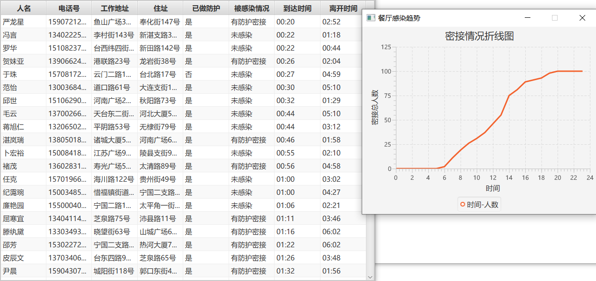
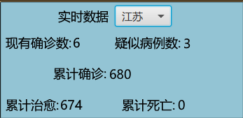

# 基本说明

#### 这个项目有什么用?

​	本项目为了模拟疫情期间密切接触者的追踪与防护而编写.使用此程序可以方便地模拟疫情期间人员的出行和感染情况,本程序的发布版本中自带了随机生成的500人*5天的数据以供测试,同时源码留下了较强的可扩展性,对于地点个数/人员随机生成的某些概率,均可由用户在对应文件下修改指定的变量值后自行构建以进行测试研究.

#### 编译环境

apache-maven-3.6.3(jdk 1.8.0_261)(不推荐用户在jdk8以下的环境中改写编译,以免出现各种奇怪的错误,此外,由于本项目基于JavaFX,jdk10以上的版本已不再自带JavaFX框架,需要用户自行适配)

# 使用方式

#### 功能介绍

​	打开程序后,程序将自动读取/app下的日期信息存储文件(1日~31日.txt),该信息文件可手动编写,也可通过源码中提供的RandomHuman脚本进行任意人数/天数信息的生成,其中人员出行频繁程度、防护意愿均可方便地进行改写,以.信息文件每行(对应单个人员)的格式如下,用户也可自行根据以下格式对数据进行自定义.

| 人名  |  工作地址   | 住址  |电话号码|是否做防护措施|感染等级|今日行程
  :----:  | :----:  |  :----: | :----:  | :----:  | :----:  | :----:  | :----:  
 样例  | 汤翔伦 |澳门二路50号|福山支广场70号|13805523825|是|感染者| 03:49~06:03-写字楼2……
​	上例中的信息在文件中实际存储如下.需要说明的是,感染等级共分为4级:0级-未感染者,1级-有防护密接者,2级-无防护密接者,3级-感染者.
汤翔伦 澳门二路50号 福山支广场70号 13805523825 true 3 03:49~06:03-写字楼2,07:29~11:08-公寓1,15:26~16:41-教学楼
​	用户可在主界面左上角选择计算日期,在读取并计算出当天密接者后,程序将自动把密接者信息保存到/app下,并可展示给用户如下所示的密接信息/趋势情况.

​	除演示功能外,本程序可通过接口获取现实疫情的实时数据,直接在复选框中选择所需查看的省份即可获取相应数据,帮助用户更好地了解当前疫情形式.

​	此外,本程序模拟了疫情严重期间对于各地区风险等级的划分,如下所示,在一个地点下分别有0/>0/>30/>50个密接者时,该地点对应的按钮颜色将被对应改为蓝色/黄色/橙色/红色.

#### 我该如何打开?

​	1.直接运行jar(需jre环境),在程序根目录的app文件夹下有该程序的jar文件,有JAVA环境的用户可以在终端进入该目录后输入java -jar contact_tracer_visualized-1.0-SNAPSHOT-jfx.jar命令执行.
​	2.运行打包好的可执行文件(已含环境),直接打开程序根目录下的exe文件即可,仅限windows平台用户.

#### 为什么xx功能不能正常使用?

​	若基本的文件位置没有出错,最大的可能是实时数据模块使用的接口失效了,出现此问题时应当会有弹窗提示,请提出issue由作者解决(也可自行修改模块中的接口部分后重新编译).

